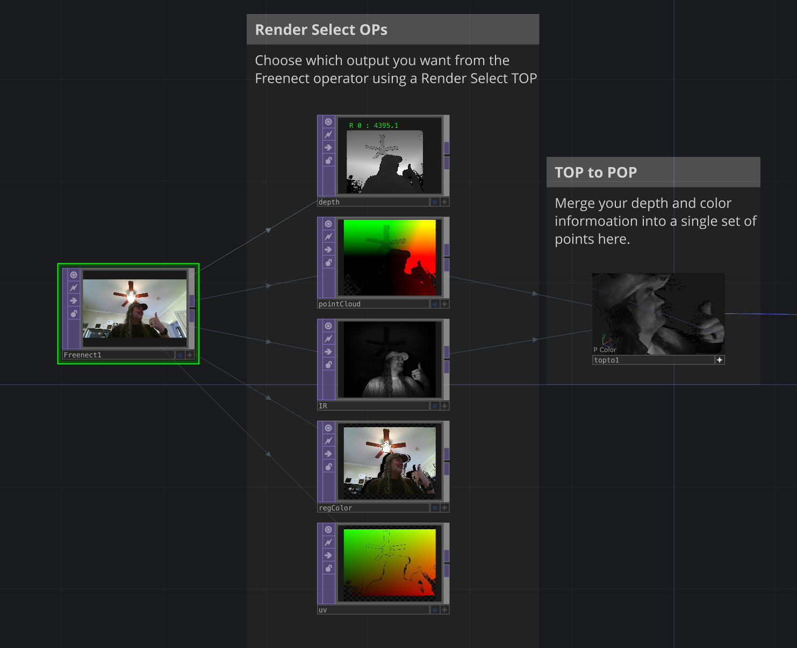

# FreenectTD
FreenectTD is an open-source TouchDesigner plugin aimed at macOS users who don't have a way to use the official Kinect OPs in TouchDesigner.

It leverages [libfreenect](https://github.com/OpenKinect/libfreenect) and [libfreenect2](https://github.com/OpenKinect/libfreenect2) to implement support for Kinect cameras.

> [!IMPORTANT] 
> FreenectTD is an experimental project. While being thoroughly tested and confirmed to work on multiple platforms, it may still have some bugs or stability issues. Please be careful if using in a production environment. I don't take any responsibility.

### Requirements
* Apple Silicon Mac
* macOS 12.4+ (Monterey)
* TouchDesigner 2025+ (any license)
* Kinect V1 / Kinect V2

### Supported features
| Feature                                       | Kinect V1 | Kinect V2 |
| --------------------------------------------- | --------- | --------- |
| RGB streaming                                 | ✅         | ✅         |
| Depth map streaming                           | ✅         | ✅         |
| Point cloud map streaming                     | ❌         | ✅         |
| IR streaming                                  | TBA       | ✅         |
| Tilt control                                  | ✅         | ❌         |
| Depth undistortion (Depth Format menu)        | ❌         | ✅         |
| Depth registration (align depth map to color) | ✅         | ✅         |
| Manual depth range threshold                  | ✅         | ✅         |
| Depth output in millimeters / meters (32-bit) | ✅         | ✅         |
| Color-camera-space point cloud (aligned to RGB) | ❌       | ✅         |
| Registered color + depth→color UV map         | ❌         | ✅         |

### Known issues
Tilt control may not work with some V1 models (1473 and Kinect for Windows V1). This is due to a mix of different factors in libfreenect and Kinect official firmware.

## [RECOMMENDED] Installing using installer

1. [Download the latest installer build from the releases tab](https://github.com/stosumarte/FreenectTD/releases/latest/download/FreenectTOP_Installer.pkg) 

2. Right click on `FreenectTOP_[version]_Installer.pkg` and select "Open"

You should now find FreenectTOP under the "Custom" OPs panel.

> [!TIP]
> If the Installer gets blocked from running, go to `System Settings > Privacy & Security` and click on `Run Anyway`

## Installing Manually

### Global Installation

1. [Download the latest zip build from the releases tab](https://github.com/stosumarte/FreenectTD/releases/latest/download/FreenectTOP.zip)

2. Unzip and copy `FreenectTOP.plugin` to TouchDesigner's plugin folder, which is located at `/Users/<username>/Library/Application Support/Derivative/TouchDesigner099/Plugins`. You might need to show hidden files by pressing `⌘⇧.`.

You should now find FreenectTOP under the "Custom" OPs panel.

### Project-specific Installation

1. [Download the latest zip build from the releases tab](https://github.com/stosumarte/FreenectTD/releases/latest) 

2. Unzip and copy `FreenectTOP.plugin` next to your .toe, in a folder named `Plugins`.

You should now be able to open your .toe and find FreenectTOP under the "Custom" OPs panel.

## Usage
By default, FreenectTOP outputs RGB data. To get other streams, you must use Render Select TOPs and reference the following indexes:

| Index | Stream | Format | Notes |
| ----- | ------ | ------ | ----- |
| 0 | RGB | RGBA8 | |
| 1 | Depth | Mono16 or Mono32F | See *Depth Output* below |
| 2 | Point cloud (v2) | RGBA32F | XYZ in meters, A = 1 for valid points, 0 for invalid |
| 3 | IR (v2) | Mono16 | |
| 4 | Registered color (v2) | RGBA8, 512x424 | RGB image resampled onto the depth grid, A = 0 where no color pixel exists |
| 5 | Depth→color UV map (v2) | RGBA32F, 512x424 | (u, v, 0, valid) in TouchDesigner UV space, pointing into the RGB output. Lets you sample full-resolution RGB per depth pixel (Remap TOP / GLSL) instead of the 512x424 pre-sampled stream 4 |

### Depth Output
*Format* applies to both the depth map and the point cloud: Raw and Raw Undistorted keep them in the depth camera (512x424 on v2), Registered re-projects both into the color camera so they line up with the RGB output pixel for pixel. (v1 has no point cloud and no undistortion; the menu only changes the depth map there.) *Depth Output* selects how depth is packed into stream 1:

* **Normalized 16-bit** (default, legacy) – 0..1 across the *Depth Threshold Min/Max* window.

*Depth Threshold Min/Max* are in millimetres on both devices (defaults when *Manual Depth Threshold* is off: 400–4500 mm for v1, 100–4500 mm for v2). Pixels outside the window are set to 0 in every depth mode and dropped from the point cloud.
* **Millimeters (32-bit float)** – raw sensor value in mm, no rescaling. 0 = invalid or outside the threshold window.
* **Meters (32-bit float)** – same, divided by 1000.

The Resolution page offers downscale presets per stream. Every size is a nearest-neighbour downscale of the native frame (v1: 640x480, v2: 1920x1080 RGB and 512x424 depth/IR), so no depth values are interpolated across object edges and the field of view never changes. Registered depth and the Registered point cloud follow the RGB resolution.

### Aligning the point cloud with the RGB image (Kinect v2)
There are two ways to get a colored point cloud:

* **Format = Registered** – stream 2 becomes a 1920x1080 XYZ map in the color camera's coordinate frame, pixel-aligned with the RGB output (stream 0) and with the *Registered* depth map. Use the pixel position as the texture coordinate to color each point. The point cloud resolution follows the RGB resolution in this mode.
* **Format = Raw** (default) with stream 4 (Registered Color) and/or stream 5 (UV) enabled – stream 2 stays 512x424 in the depth camera frame. Stream 4 gives the color for each point directly, and stream 5 gives the UV of each point in the RGB output, which you can feed to a Remap TOP together with stream 0 to sample color at full resolution.

Note that the two spaces are offset by the physical baseline between the two cameras (roughly 5 cm along X), so do not mix them in one render.

The native frame is +Y up and +Z pointing away from the sensor, and X follows the mirrored image. *Point Cloud Flip X/Y/Z* negate an axis; turn on *Point Cloud Flip Z* to get a TouchDesigner-style cloud in front of a camera that looks down -Z.

### Colored point cloud as a POP (TouchDesigner 2025+)
A TOP to POP turns the streams into renderable points with color in two nodes:

1. **TOP to POP** – *First RGBA Contains* = `Position and Active`, TOP = the point cloud (stream 2). Only pixels with A = 1 become points.
2. Add a second TOP block: TOP = the registered color (stream 4) when *Format* is `Raw`, or the RGB output (stream 0) when it is `Registered`; Channel Scope `r g b a`, Attribute Scope `Color`, Filter `Nearest Pixel`.
3. Render it from a Geometry COMP with a Constant MAT that has *Apply Point Color* on. A camera at the origin rotated 180° around Y looks down +Z like the Kinect.

`toe_examples/FreenectTOP_Example_Dean_claude.toe` contains this network (`colorSrc`, `pcGeo/kinect_pointcloud`, `pcMat`, `pcCam`, `pcRender`); `colorSrc` is a Switch TOP that follows the *Format* parameter automatically.

### Examples
Example .toe project files are provided in this repository, under the `toe_examples` directory.

### Known limitations

* Only one Kinect device per machine is supported.
* Only one FreenectTD OP can be active at a time.
* Skeleton tracking is currently impossible to implement.

## Uninstalling

To uninstall all FreenectTD related files, run the following command in terminal:
`sudo rm -rf ~/Library/Application\ Support/Derivative/TouchDesigner099/Plugins/Freenect*.plugin`

## Donations
If you like FreenectTD, please consider donating to support further development!

 

## Credits

A very big thank you goes to the OpenKinect project, who developed the libraries that made this plugin possible.

## Licensing

**FreenectTD** is licensed under the **GNU Lesser General Public License v2.1 (LGPL-2.1)**.  
This means you are free to use, modify, and distribute this plugin, including in closed-source applications, provided that any modifications to the plugin itself are released under the same LGPL v2.1 license.

This project also includes the following third-party libraries, each under their respective licenses:

- **libfreenect** – Apache 2.0 License  
  [Full License Text](https://raw.githubusercontent.com/OpenKinect/libfreenect/master/APACHE20)

- **libfreenect2** – Apache 2.0 License  
  [Full License Text](https://raw.githubusercontent.com/OpenKinect/libfreenect2/master/APACHE20)

- **libusb** – LGPL 2.1 License  
  [Full License Text](https://raw.githubusercontent.com/libusb/libusb/master/COPYING)

By downloading, using, modifying, or distributing this plugin, either as source-code or binary format, you agree to comply with the terms of both the **LGPL-2.1** license for the plugin itself and the respective licenses of the third-party libraries included.
