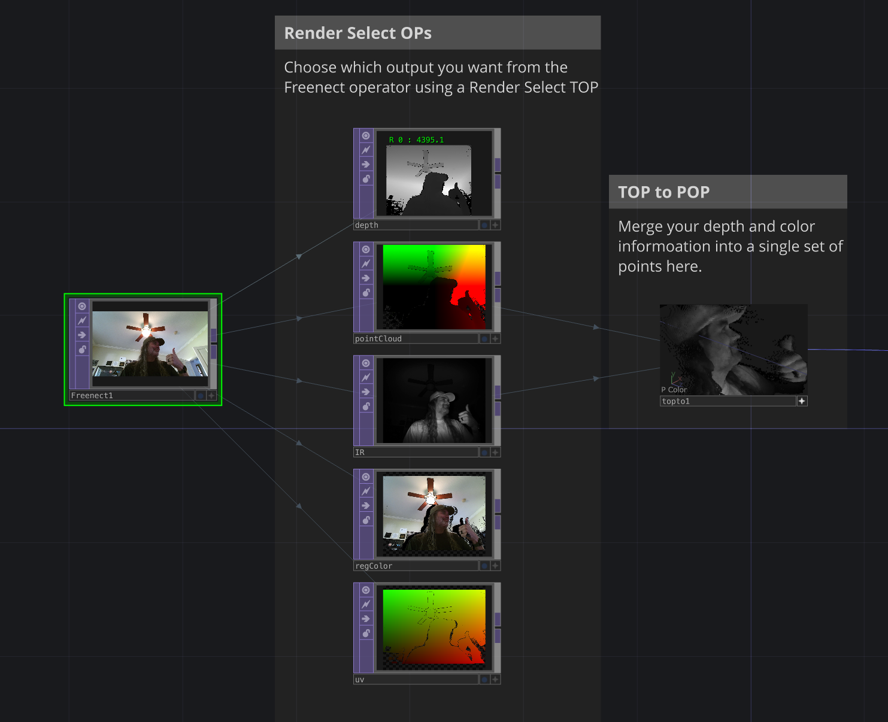

# FreenectTD
FreenectTD is an open-source TouchDesigner plugin aimed at macOS users who don't have a way to use the official Kinect OPs in TouchDesigner.

It leverages [libfreenect](https://github.com/OpenKinect/libfreenect) and [libfreenect2](https://github.com/OpenKinect/libfreenect2) to implement support for Kinect cameras.

> [!IMPORTANT] 
> FreenectTD is an experimental project. While being thoroughly tested and confirmed to work on multiple platforms, it may still have some bugs or stability issues. Please be careful if using in a production environment. I don't take any responsibility.

### Requirements
* Apple Silicon Mac
* macOS 12.4+ (Monterey)
* TouchDesigner 2025.33230+ (any license)
* Kinect V1 / Kinect V2

### Supported features
| Feature                                       | Kinect V1 | Kinect V2 |
| --------------------------------------------- | --------- | --------- |
| RGB streaming                                 | ✅         | ✅         |
| Depth map streaming                           | ✅         | ✅         |
| Point cloud map streaming                     | ❌         | ✅         |
| IR streaming                                  | ✅         | ✅         |
| Tilt control                                  | ✅         | ❌         |
| Depth undistortion (Format menu)              | ❌         | ✅         |
| Depth registration (align depth map to color) | ✅         | ✅         |
| Manual depth range                            | ✅         | ✅         |
| Depth output in millimeters / meters (32-bit) | ✅         | ✅         |
| Color-camera-space point cloud (aligned to RGB) | ❌       | ✅         |
| Registered color + depth→color UV map         | ❌         | ✅         |

### Known issues
Tilt control may not work with some V1 models (1473 and Kinect for Windows V1). This is due to a mix of different factors in libfreenect and Kinect official firmware.

The V1 IR image is covered in bright dots. This is expected: it is the pattern the V1's laser projector casts to measure depth.

## [RECOMMENDED] Installing using installer

1. [Download the latest installer build from the releases tab](https://github.com/stosumarte/FreenectTD/releases/latest/download/FreenectTOP_Installer.pkg) 

2. Right click on `FreenectTOP_[version]_Installer.pkg` and select "Open"

You should now find FreenectTOP under the "Custom" OPs panel.

> [!TIP]
> If the Installer gets blocked from running, go to `System Settings > Privacy & Security` and click on `Run Anyway`

## Installing Manually

### Global Installation

1. [Download the latest zip build from the releases tab](https://github.com/stosumarte/FreenectTD/releases/latest/download/FreenectTOP.zip)

2. Unzip and copy `FreenectTOP.plugin` to TouchDesigner's plugin folder, which is located at `/Users/<username>/Library/Application Support/Derivative/TouchDesigner099/Plugins`. You might need to show hidden files by pressing `⌘⇧.`.

You should now find FreenectTOP under the "Custom" OPs panel.

### Project-specific Installation

1. [Download the latest zip build from the releases tab](https://github.com/stosumarte/FreenectTD/releases/latest) 

2. Unzip and copy `FreenectTOP.plugin` next to your .toe, in a folder named `Plugins`.

You should now be able to open your .toe and find FreenectTOP under the "Custom" OPs panel.

## Usage
FreenectTOP outputs RGB. Every other stream is reached with a Render Select TOP set to its index:

| Index | Stream | Format |
| ----- | ------ | ------ |
| 0 | RGB | RGBA8 |
| 1 | Depth | Mono16 (Normalized) or Mono32F (mm / m) |
| 2 | Point cloud (v2) | RGBA32F: XYZ in meters, A = 1 for valid points |
| 3 | IR | Mono16 |
| 4 | Registered color (v2) | RGBA8: RGB resampled onto the depth grid, A = 0 where there is no color |
| 5 | Depth→color UV (v2) | RGBA32F: (u, v, 0, valid) into the RGB output, for a Remap TOP |

Streams come out at native resolution: 640x480 on v1; on v2 1920x1080 RGB and 512x424 for everything else, except Registered depth and point cloud, which match RGB. With a Non-Commercial license, v2 RGB (and those two) is 1280x720. To scale further, use a Resolution TOP (*Input Smoothness* = *Nearest Pixel* for depth and point cloud).

Example projects are in `toe_examples/`.

### Parameters

**Device**
* *Active* – only one FreenectTOP can be active per TouchDesigner process; turn it off to hand the Kinect to another one.
* *Hardware Version* – Kinect v1 (Xbox 360) or Kinect v2 (Xbox One).
* *Tilt Angle* – v1 motor tilt.

**Streams** – toggles for streams 1–5. On v1, RGB and IR share one stream, so RGB [0] is blank while *IR* is on.

**Depth**
* *Format* – *Raw* keeps depth and the point cloud in the depth camera; *Raw undistorted* also removes lens distortion (v2 only); *Registered* re-projects both into the color camera, pixel-aligned with RGB.
* *Depth Output* – *Normalized 16-bit* (0–1 across the depth range), *Millimeters* or *Meters* (32-bit float).
* *Manual Depth Range*, *Depth Range Min/Max* – the valid depth window in mm, up to 8000 (the v2 is rated to 4.5 m and gets noisier beyond). When off: 400–4500 mm on v1, 500–4500 mm on v2.
* *Unknown Depth Value* – written to pixels with no reading or outside the range (clamped to 0–1 in Normalized).

**Point Cloud** (v2)
* *Point Cloud Flip X/Y/Z* – the native frame is +Y up, +Z away from the sensor; *Flip Z* gives a TouchDesigner-style cloud in front of a camera looking down -Z.
* *Unknown Point Value* – XYZ written to invalid points; their alpha is always 0, so alpha stays the reliable validity mask.

Use finite values for the unknown values (e.g. 10000 mm) rather than NaN, which spreads through blurs and averages.

### Colored point cloud (Kinect v2)
* **Format = Registered** – the point cloud [2] is pixel-aligned with RGB [0]: use the pixel position to color each point.
* **Format = Raw** – the point cloud stays in the depth camera; Registered color [4] colors each point directly, or UV [5] samples full-resolution RGB with a Remap TOP.

The two spaces are about 5 cm apart (the distance between the cameras), so don't mix them in one render.

To render it as a POP: a **TOP to POP** with *First RGBA Contains* = `Position and Active` on stream 2, plus a second TOP block reading the color (stream 4 for Raw, stream 0 for Registered) into `Color` with *Filter* = `Nearest Pixel`. Render it with a Constant MAT with *Apply Point Color* on. `toe_examples/FreenectTOP_PointCloud_Example.toe` contains this network.

### Known limitations
* Like every TOP, FreenectTOP only cooks when something uses its output. If Render Selects stop updating in perform mode or another network, end the chain in a Null TOP with its display flag on.
* Only one Kinect per machine is supported.
* Skeleton tracking is currently impossible to implement.

## Uninstalling

To uninstall all FreenectTD related files, run the following command in terminal:
`sudo rm -rf ~/Library/Application\ Support/Derivative/TouchDesigner099/Plugins/Freenect*.plugin`

## Donations
If you like FreenectTD, please consider donating to support further development!

 

## Credits

A very big thank you goes to the OpenKinect project, who developed the libraries that made this plugin possible.

## Licensing

**FreenectTD** is licensed under the **GNU Lesser General Public License v2.1 (LGPL-2.1)**.  
This means you are free to use, modify, and distribute this plugin, including in closed-source applications, provided that any modifications to the plugin itself are released under the same LGPL v2.1 license.

This project also includes the following third-party libraries, each under their respective licenses:

- **libfreenect** – Apache 2.0 License  
  [Full License Text](https://raw.githubusercontent.com/OpenKinect/libfreenect/master/APACHE20)

- **libfreenect2** – Apache 2.0 License  
  [Full License Text](https://raw.githubusercontent.com/OpenKinect/libfreenect2/master/APACHE20)

- **libusb** – LGPL 2.1 License  
  [Full License Text](https://raw.githubusercontent.com/libusb/libusb/master/COPYING)

By downloading, using, modifying, or distributing this plugin, either as source-code or binary format, you agree to comply with the terms of both the **LGPL-2.1** license for the plugin itself and the respective licenses of the third-party libraries included.
